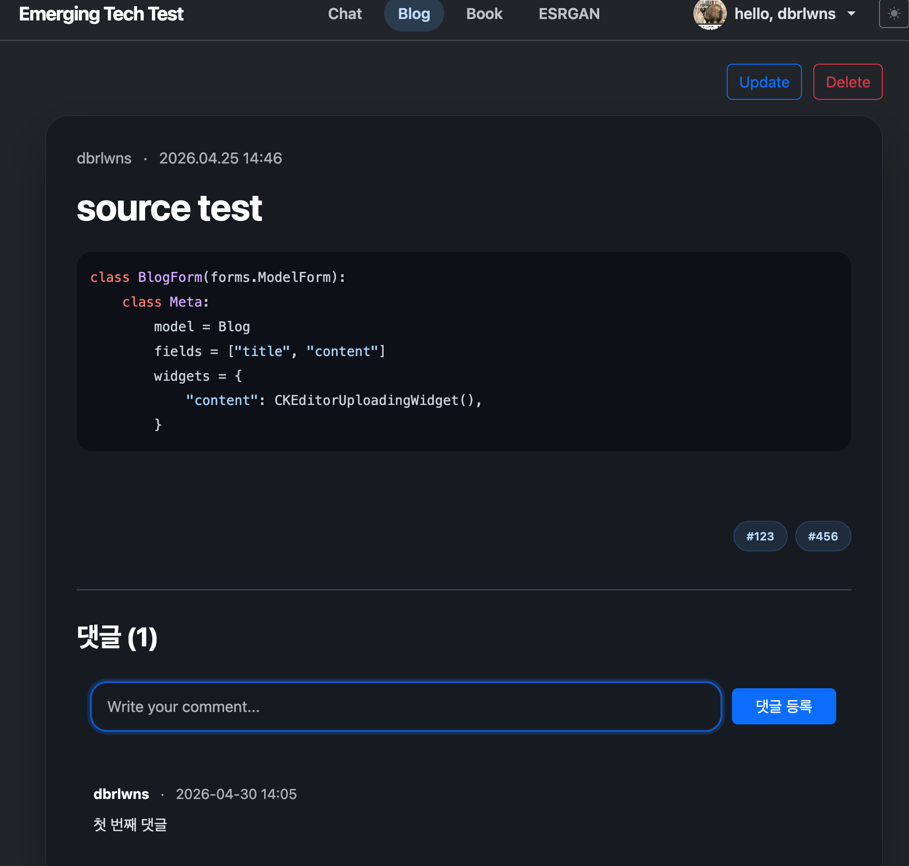
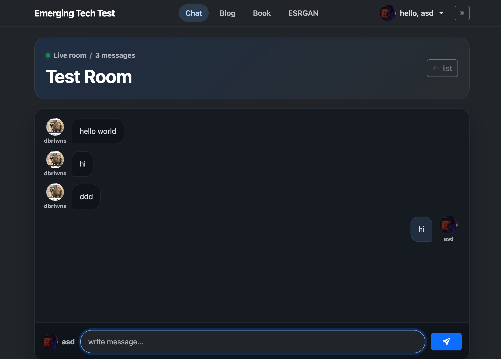
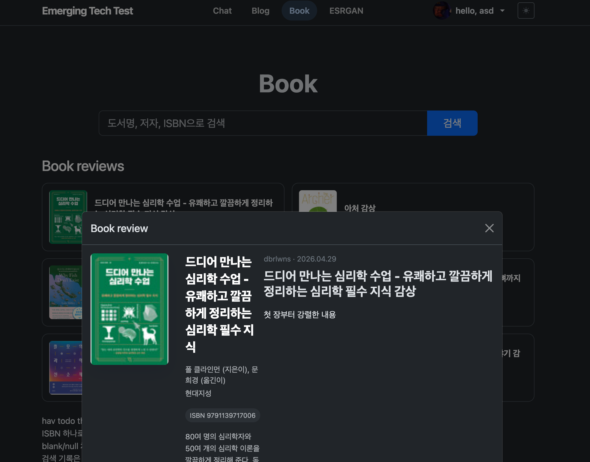

# 프로젝트 이름
Bookshelf (책장)
<br /><br />

## 소개
블로그 + 실시간 채팅 + 도서와 커뮤니티 기능이 있는 서비스
<br /><br />

## 주요 기능
- 블로그
- CKEditor 작성
- 태그 기반 글 분류
- 댓글 작성 채팅
- 실시간 채팅 도서관
- 도서 검색
- 도서 기반 독서 기록

<br /><br />
## 기술 스택
- Backend: Django
- Database: SQLite
- WebSocket: Django Channels
- Frontend: Django Template, Bootstrap, JavaScript(highlight.js)
- External API: Aladin Open API
- Editor: CKEditor


<br /><br />
## 구조 및 기술 흐름
- blog 앱
커스텀된 CKEditor 블로그, 댓글, 태그 분류, 사용자 확인

blog_add(request) - form 필드 검증, 입력받은 태그를 split 하고 생성/조회 후 blog에 외래키로 붙입니다. 
comment_add(request, pk) - pk로 현재 블로그를 가져오고 비로그인 접근/json값 이상/빈 내용에 대한 에러처리를 json으로 넘기고, 
    정상적인 요청이면 Comment 인스턴스를 생성 후 JsonResponse로 데이터와 201 status를 전송합니다.

Blog는 ManyToManyField로 Tag를 여러 개 가질 수 있는데, 이때 ManyToManyField는 내부에 list로 데이터를 관리합니다. 
    사용자는 태그를 문자열로 입력하고, form은 문자열을 정리하고, Tag 객체로 만들어 Blog와 연결합니다.

blog_list(request) - tag 명을 query string로 받아 해당하는 블로그 모델만 표시가 가능합니다.



- chat 앱
asgi.py : 웹소켓 요청을 받으면 호스트 검증 -> routing.py로 전달하여 소켓 연결(사용자 정보 사용가능)

routing.py : websocket용 urls.py, 요청 url을 consumer로 연결시킵니다. (연결을 처리할 consumer을 선택)

consumers.py : websocket 연결 후 실시간 메시지를 처리합니다.
    connect(self) : 요청에서 slug 값을 빼내어 채널 그룹에 참가합니다. 
        각 사용자는 (웹소켓에) channel name을 독립적으로 가지고, group name으로 채널에 참여합니다.
    receive(self, text_data) : 인자의 문자열을 딕셔너리로 반환 후 이벤트명과 함께 그룹에 전송합니다.
    chat_message(self, event) : 채팅방의 클라이언트에게 json 문자열을 전송합니다.
    save_message(self, author, content) : 채팅방에 메시지를 DB에 저장하고 사용자 이미지를 반환합니다.
                                            @database_sync_to_async로 ORM 명령을 비동기 환경에서 사용 
    views.py : slug를 확인하고 웹 페이지를 렌더링하는 역할만 수행합니다.



- library 앱
clients.py : api 요청을 보내고 응답을 받아 딕셔너리 형태로 반환합니다.
    search_books(...) : 도서 검색 시 api 요청을 보내 데이터를 받아옵니다. (알라딘 사용 예제)
                        api 응답은 네트워크에서 byte로 오기 때문에 디코딩하여 문자열로 변환이 필요합니다.

services.py : clients.py에서 도서 데이터를 받아 Book 모델에 저장합니다.
    normalize_book_data(data) : isbn, 작가 정보를 가져와 도서 정보가 담긴 딕셔너리를 반환합니다.
    save_book_from_api_data(data) : 도서 데이터를 받아 생성하거나 정보를 갱신하여 저장 후 반환합니다.



<br /><br />
## 보완할 내용
- 비밀번호 암호화 커스텀
- 블로그 좋아요 기능
- 도서 기록 추천 알고리즘

<br /><br />
## 실행 방법
- 저장소 클론
```bash
git clone https://github.com/dbrlwns/Rough-paper.git
cd Bookshelf
```

- 가상환경 설정 및 패키지 설치
```bash
python3 -m venv .venv
source .venv/bin/activate
python -m pip install --upgrade pip
python -m pip install -r requirements.txt
```
- 환경변수 설정과 마이그레이션
```bash
echo "ALADIN_API_KEY=ttbxxxxxxx" >> .env
python manage.py migrate
```
- 실행
```bash
python manage.py runserver
```
<br /><br />